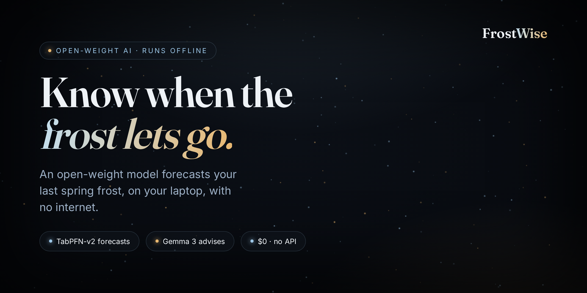
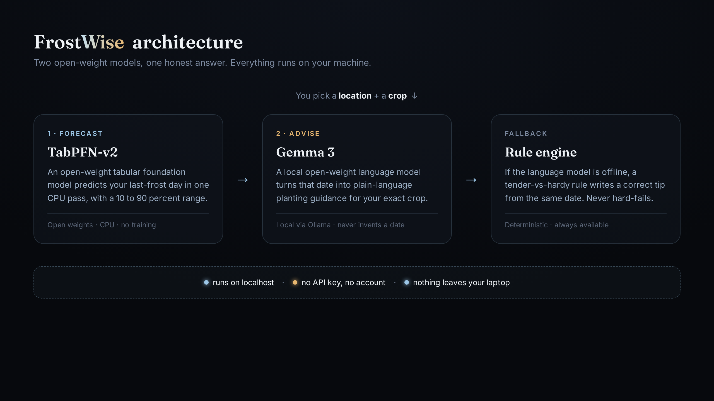
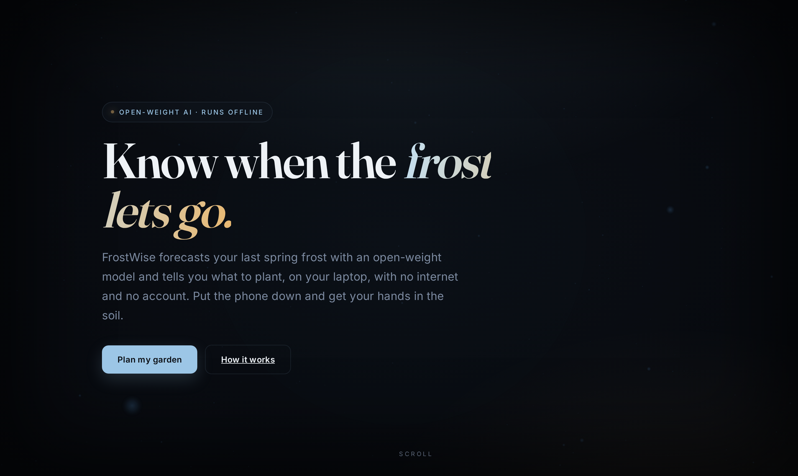
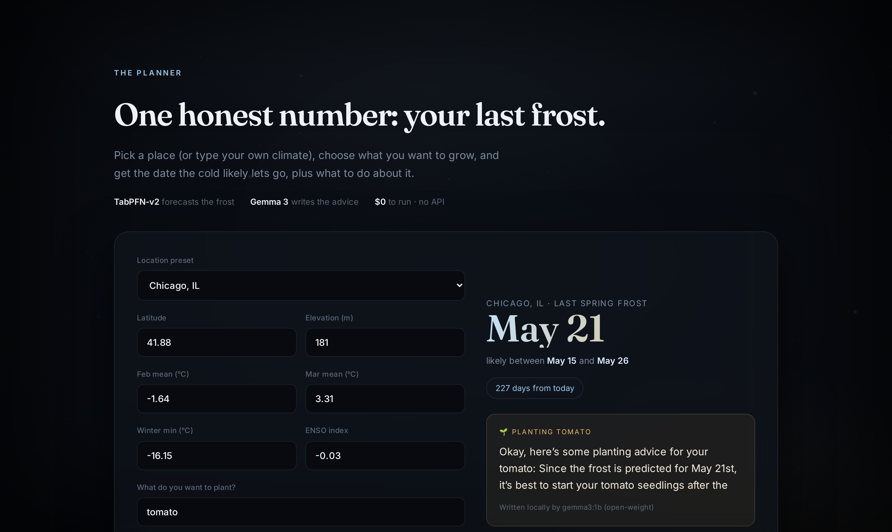

<div align="center">

# 🌱 FrostWise: Know When the Frost Lets Go (2026)

### An offline-first planting planner. An open-weight model forecasts your last spring frost and tells you what to plant, on your own laptop, with no internet, no account, and no API bill. The frost date is predicted by a tabular foundation model, the advice is written by a local language model, and nothing you type ever leaves your machine.

[](#-how-it-works-two-open-models-one-honest-answer)
[](https://github.com/PriorLabs/TabPFN)
[](https://ai.google.dev/gemma)
[](#-getting-started)
[](LICENSE)

**Hacktoberfest Open-Source AI Challenge** · Week 1: `Touch Grass`



**🌐 Website:** [sarvarnadaf.com](https://sarvarnadaf.com) &nbsp;·&nbsp; **💻 Run it:** [Getting Started](#-getting-started) (it is an offline app by design, so you run it locally) &nbsp;·&nbsp; **🎬 YouTube demo:** coming soon

</div>

> [!NOTE]
> **No hosted link, on purpose.** FrostWise runs two open-weight models on your own
> machine. The whole point is that it works with no server and no internet, so the "demo"
> is cloning it and running `python run.py`. See the [2-minute walkthrough](#-what-it-looks-like) below.

> [!IMPORTANT]
> **FrostWise is a planning aid, not a guarantee.** A last-frost date is a forecast with a
> range, not a promise. Watch your local sky before you plant anything tender. FrostWise is
> honest about its range and never pretends to a precision it does not have. See
> [The Honest Take](#-the-honest-take).

---

## 🤔 The Problem

The single most useful number in a vegetable garden is the **last spring frost date**. Plant
a tomato a week too early and one cold night kills it. Plant too late and you lose weeks of
season. Gardeners look this up on a website, on a phone, over a signal that is often not there
at the allotment, the community plot, or the trail-head herb patch.

The forecast itself is a small-data prediction problem: a handful of climate features
(latitude, elevation, late-winter temperatures) against decades of local records. That is
exactly the kind of problem an **open-weight tabular model runs on a laptop in one second**,
and exactly the kind of thing you should not have to send to someone else's cloud.

**FrostWise answers the question where you actually are: offline, on your own machine, for
free.** An open-weight model predicts the date, a local language model explains what to do
about it, and the whole thing works with the Wi-Fi off.

---

## 🌿 What You Get (from one location)

Pick a place (or type your own climate), choose what you want to grow, and FrostWise returns
a calm, dated answer in seconds.

### 🗓️ The one date, with a range
It predicts your last-frost day and shows the honest 10 to 90 percent window around it, so
you know the risk, not just a false-precision single day.

### 🌱 What to do about it, in plain language
A local Gemma model turns the date into guidance for your exact crop: wait until after the
frost for tender crops like tomato and basil, sow a few weeks early for hardy crops like peas
and kale.

### 📍 20 built-in climate presets
Real last-frost climatology for 20 United States locations from Miami to Caribou, or type
your own latitude, elevation, and winter temperatures.

### 📴 Works with the internet off
Once the models are on your machine, the Wi-Fi can die and FrostWise still answers. If the
language model is unreachable it falls back to a correct rule-based tip rather than failing.

---

## 🧠 How It Works: two open models, one honest answer

<div align="center">

</div>

The whole project is two open-weight models doing one honest job each, locally.

| Layer | Who decides | What happens |
|-------|-------------|--------------|
| **Forecast** | TabPFN-v2 (open weights) | A tabular foundation model predicts the last-frost day-of-year from climate features in one CPU forward pass, with a calibrated 10 to 90 percent range. No per-dataset training. |
| **Advise** | Gemma 3 (open weight, local via Ollama) | The model turns the predicted date plus your crop into short, plain-language planting guidance. It is told the date; it never invents one. |
| **Fallback** | Deterministic rule (code) | If Ollama is unreachable, a tender-vs-hardy rule writes a correct tip from the same date, so the app never hard-fails offline. |

Both models run on your machine. There is no API key, no account, and no request that leaves
`localhost`.

---

## 📸 What it looks like

### The homepage
<div align="center">

</div>

### The one date, with its range, and local planting advice
<div align="center">

</div>

### 🎬 Full walkthrough (YouTube)
A 2-minute demo running three real forecasts (Miami, Chicago, Fargo) fully offline is
**coming soon**. The source video is in the repo at [`docs/demo.mp4`](docs/demo.mp4).

---

## 🔥 The Three Open Beats

### 📴 Beat 1 - It works with no signal
Both models live on your disk. On a hillside allotment with one bar of signal, a closed API
is useless. FrostWise still answers, because the forecast and the advice both run locally.

### 🔒 Beat 2 - Your location never leaves your laptop
Where you garden is personal. FrostWise sends nothing to a server, logs nothing, and needs no
sign-in. The whole exchange is between you and your own machine.

### 🔁 Beat 3 - You own the brain
Point the advice at a bigger Gemma, swap in any open-weight model Ollama can run, or retrain
TabPFN on your own weather-station CSV. Nothing here is locked to a vendor you cannot inspect.

---

## 🛠️ Tech Stack

| Layer | Choice |
|-------|--------|
| Frost forecast | [TabPFN-v2](https://github.com/PriorLabs/TabPFN), open-weight tabular foundation model, CPU, scikit-learn interface |
| Planting advice | [Gemma 3](https://ai.google.dev/gemma) open-weight LLM, served locally by [Ollama](https://ollama.com) |
| Offline fallback | Deterministic tender-vs-hardy rule in Python |
| API | FastAPI + Uvicorn (localhost only) |
| Front end | Single-page HTML, Three.js midnight-galaxy background, GSAP motion, no build step |
| Data | 20 US stations x 20 years of last-frost climatology (public-domain, in-repo) |
| Runtime | Pure CPU. No GPU, no cloud, no account. |

---

## 🚀 Getting Started

### 1. Install the open models and dependencies

```bash
git clone https://github.com/simplynadaf/frostwise.git
cd frostwise

# CPU-only PyTorch (skip if you have a GPU build you prefer)
pip install torch --index-url https://download.pytorch.org/whl/cpu
pip install -r requirements.txt

# the local language model (open-weight) via Ollama
# install Ollama from https://ollama.com, then:
ollama pull gemma3:1b
```

### 2. Run it

```bash
python run.py
# FrostWise -> http://127.0.0.1:8077
```

Open the link, click **Plan my garden**, pick a location, choose a crop, and
**Forecast my frost**. The first forecast downloads the TabPFN-v2 weights once and caches
them; after that it runs fully offline.

### 3. Prove it is offline

Pull the network cable or turn off Wi-Fi after the models are cached, then run a forecast
again. The frost date (TabPFN) still computes locally; if the language model is reachable it
writes the advice, otherwise the deterministic rule does. Nothing calls out.

<details>
<summary>Run the forecaster on its own (no server, no language model)</summary>

```bash
python -m frostwise.forecast     # prints a Chicago last-frost forecast from TabPFN-v2
```

</details>

<details>
<summary>Rebuild the climate dataset</summary>

```bash
python scripts/build_dataset.py  # regenerates data/frost_history.csv
```

</details>

---

## 📁 Project Structure

```
frostwise/
├── frostwise/               # the open-weight AI core (Python package)
│   ├── __init__.py
│   ├── api.py               # FastAPI app: wires forecast + advice, serves the UI
│   ├── forecast.py          # TabPFN-v2 engine: last-frost prediction + 10-90% range
│   └── advice.py            # Gemma 3 engine (local Ollama) + offline rule-based fallback
├── web/                     # front end (no build step)
│   ├── index.html           # single-page premium UI
│   └── assets/
│       ├── app.js           # presets, forecast call, animated results
│       └── scene.js         # Three.js midnight-galaxy background
├── data/
│   └── frost_history.csv    # 20 US stations x 20 years of last-frost climatology
├── scripts/
│   ├── build_dataset.py     # regenerate the dataset
│   ├── serve.sh             # dev launcher
│   └── screenshot.py        # dev-only visual QA
├── docs/                    # cover, architecture diagram, screenshots
├── run.py                   # one command to run everything
├── requirements.txt
├── LICENSE                  # MIT
└── README.md
```

---

## ⚖️ Why Open Innovation Matters

A closed, hosted model would have made this project worse in every way that counts for a
gardener:

- **Offline is the whole point.** The place you most need a frost date, the plot with no
  signal, is exactly where a closed API cannot reach. Open weights on your own disk work
  there.
- **Your plans are yours.** No account, no server, no log. A hosted model would turn "where
  do you garden" into someone else's data.
- **Free to run, forever.** Open weights mean zero per-request cost. Run it a thousand times
  for a community garden and the bill is still nothing.
- **Inspectable and swappable.** You can read how TabPFN predicts, retrain it on your own
  records, and swap the Gemma model for any open-weight one. There is no black box and no
  vendor lock.

---

## 🧾 The Honest Take

A planting tool should not pretend to a certainty the weather does not have:

- **A last-frost date is a forecast, not a promise.** FrostWise shows a 10 to 90 percent
  range for a reason. One unusual cold snap can still land outside it. Watch your local sky
  before you set out anything tender.
- **The climate dataset is grounded but synthetic.** It is generated from documented
  last-frost norms for 20 real United States locations, so the relationships are realistic,
  but it is a teaching dataset, not a live weather feed. Swap in your own station records to
  make it yours.
- **The language model only narrates.** No date comes from Gemma. The number is TabPFN's; the
  model just explains what to do with it. If the advice ever reads oddly, that is the small
  1B model, and you can point `run.py --model` at a larger one.
- **CPU, so it is unhurried.** A forecast takes a few seconds on a laptop CPU. That is the
  cost of running everything locally instead of in someone's data center, and it is a cost
  worth paying for the offline guarantee.

---

## 🤝 Contributing

Issues and PRs welcome. The most useful contributions are real weather-station datasets for
new regions, more crops in the advice rules, and translations.

---

## 📝 License

MIT - see [LICENSE](LICENSE).

Model weights are licensed by their authors: TabPFN-v2 under the Prior Labs License
(Apache-2.0 with attribution), and Gemma under the Gemma Terms of Use.

---

<div align="center">

Built for the **Hacktoberfest Open-Source AI Challenge, Week 1: Touch Grass**

Made with 🤍 by [Sarvar](https://sarvarnadaf.com)

[](https://www.linkedin.com/in/sarvar04/)
[](https://github.com/simplynadaf)
[](https://dev.to/sarvar_04)

</div>
